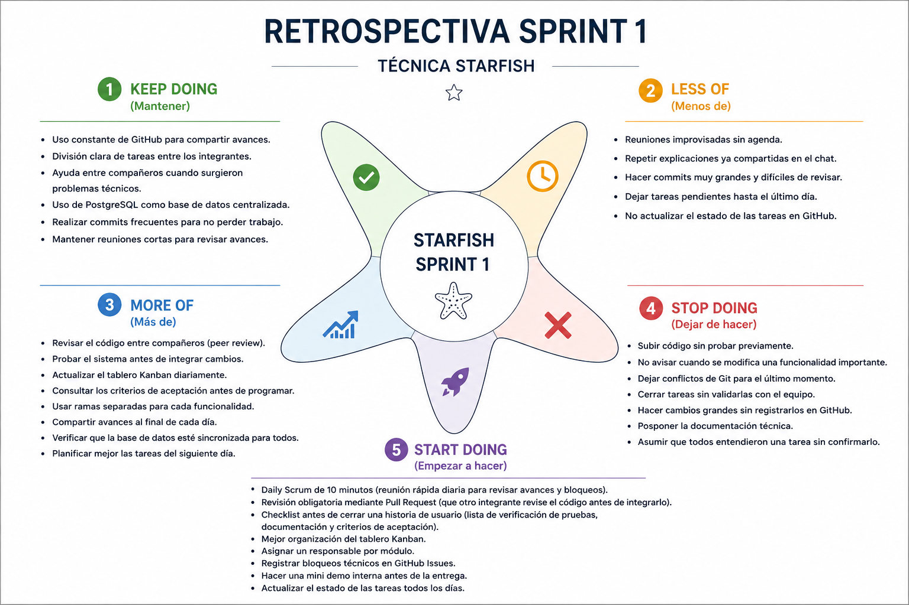

## Definition of Done (DoD)

Una Historia de Usuario se considera completada únicamente cuando cumple con todos los los siguientes criterios:

### 1. Calidad de Código

* El código pasa las verificaciones del linter sin errores ni advertencias críticas.
* Se respetan las convenciones de codificación establecidas por el equipo.
* No existen errores de compilación ni código duplicado innecesario.

### 2. Pruebas y Fiabilidad (ISO 25010 - Reliability)

* Las pruebas unitarias asociadas a la funcionalidad se ejecutan correctamente.
* La funcionalidad opera sin fallos en el entorno de integración.
* Los cambios no generan regresiones en funcionalidades existentes.

### 3. Mantenibilidad (ISO 25010 - Maintainability)

* El código es modular, legible y documentado cuando corresponde.
* Se actualizan los diagramas UML (clases y secuencia) afectados por los cambios.
* La estructura del código facilita futuras modificaciones y reutilización.

### 4. Adecuación Funcional (ISO 25010 - Functional Suitability)

* Se cumplen al 100% los criterios de aceptación definidos para la Historia de Usuario.
* La funcionalidad satisface los requisitos de negocio establecidos.
* La funcionalidad ha sido validada por el equipo.

### 5. Seguridad y Ética de Datos (ISO 25010 - Security)

* Los datos del usuario son tratados únicamente para los fines definidos por el sistema.
* No se almacenan datos sensibles innecesarios.
* Se validan las entradas del usuario para prevenir errores e inyecciones de datos.
* Se respetan principios de privacidad, confidencialidad e integridad de la información.

### 6. Compatibilidad y Eficiencia (ISO 25010)

* La funcionalidad es compatible con la arquitectura Astro, NestJS y PostgreSQL.
* Las consultas a la base de datos no presentan ineficiencias evidentes.
* No se introducen problemas de rendimiento significativos.

### 7. Revisión de Código

* Los cambios fueron enviados mediante Pull Request.
* Al menos un integrante del Squad revisó y aprobó el código.
* Todas las observaciones fueron resueltas antes de la integración.

### 8. Integración

* Los cambios fueron integrados exitosamente a la rama principal.
* El sistema funciona correctamente después de la integración.
* No existen conflictos pendientes ni errores de ejecución.

# 📌 Retrospectiva Sprint 1

Durante el cierre del Sprint 1, el equipo realizó una retrospectiva utilizando la técnica **Starfish**, con el propósito de identificar fortalezas, oportunidades de mejora y definir acciones concretas para optimizar el trabajo durante el Sprint 2.

---

# 🌟 1. Tablero Starfish

## 🟢 Keep Doing (Mantener)

- Uso constante de GitHub para compartir avances.
- División clara de tareas entre los integrantes.
- Ayuda entre compañeros cuando surgieron problemas técnicos.
- Uso de PostgreSQL como base de datos centralizada.
- Realizar commits frecuentes para evitar pérdida de trabajo.
- Mantener reuniones cortas para revisar avances.

## 🟡 Less Of (Menos de)

- Reuniones improvisadas sin agenda.
- Repetir explicaciones ya compartidas en el chat.
- Hacer commits muy grandes y difíciles de revisar.
- Dejar tareas pendientes para el último día.
- No actualizar el estado de las tareas en GitHub.

## 🔵 More Of (Más de)

- Revisar el código entre compañeros (Peer Review).
- Probar el sistema antes de integrar cambios.
- Actualizar diariamente el tablero Kanban.
- Consultar los criterios de aceptación antes de programar.
- Usar ramas separadas para cada funcionalidad.
- Compartir avances al finalizar cada jornada.
- Verificar que la base de datos esté sincronizada para todos.
- Planificar mejor las tareas del día siguiente.

## 🔴 Stop Doing (Dejar de hacer)

- Subir código sin realizar pruebas.
- No avisar cuando se modifica una funcionalidad importante.
- Dejar conflictos de Git para el último momento.
- Cerrar tareas sin validación del equipo.
- Hacer cambios grandes sin registrarlos en GitHub.
- Posponer la documentación técnica.
- Asumir que todos comprendieron una tarea sin confirmarlo.

## 🟣 Start Doing (Empezar a hacer)

- Realizar un Daily Scrum de 10 minutos.
- Implementar revisión obligatoria mediante Pull Request.
- Utilizar un checklist antes de cerrar cada Historia de Usuario.
- Mejorar la organización del tablero Kanban.
- Asignar un responsable por módulo.
- Registrar bloqueos técnicos mediante GitHub Issues.
- Realizar una mini demostración interna antes de cada entrega.
- Actualizar diariamente el estado de las tareas.

### 📷 Evidencia

---

# 📋 2. Informe de Decisiones Tomadas

| ¿Qué vamos a mejorar? | ¿Cómo sabremos que funcionó al finalizar el Sprint 2? | Guardián |
|------------------------|--------------------------------------------------------|----------|
| Implementar revisión obligatoria mediante Pull Request antes de integrar cambios. | El 100% de las funcionalidades desarrolladas serán integradas mediante Pull Request y aprobadas por al menos un integrante antes del Merge. | Nicolás |
| Realizar Daily Scrum de 10 minutos y actualizar diariamente el tablero Kanban. | Se realizarán reuniones diarias durante todo el Sprint 2 y el tablero Kanban permanecerá actualizado con el estado real de las tareas. | Sarah Carolina Chávez Valencia |

---

# 🚀 3. Tarea de mejora para el Sprint 2

Se creó una tarea en el tablero **GitHub Projects** para dar seguimiento a las mejoras acordadas durante la retrospectiva.

**Título de la tarea:**

> **Implementar revisión obligatoria mediante Pull Request y Daily Scrum para el Sprint 2**

**Objetivo**

Mejorar la calidad del código, fortalecer la comunicación del equipo y mantener un seguimiento constante del avance del Sprint.

### 🔗 Enlace a la tarea

[https://github.com/USUARIO/REPOSITORIO/projects/1?pane=issue&item=XXXX](https://github.com/0xsissN/blood-astro-nest/issues/44)

